# Kubernetes Observability Stack: Prometheus & Grafana

## Introduction

This project demonstrates an end-to-end implementation of an observability stack on a Kubernetes cluster. By deploying a sample microservices application, this repository showcases how to leverage Prometheus for real-time metric scraping and Grafana for powerful, visual data representation. It is designed to track system health, monitor CPU and memory usage, and visualize network traffic.

---

## Architecture Diagram

```mermaid
graph TD
    subgraph AWSEC2[AWS EC2 Instance]
        subgraph KindCluster[Kind Kubernetes Cluster]
            subgraph Monitoring[Monitoring Namespace]
                Grafana["Grafana<br>(Port 3000 forwarded)"]
                Prometheus["Prometheus<br>(Port 9090 forwarded)"]
                NodeExporter["Node Exporter<br>(collects metrics)"]
            end
            subgraph Application[Application Namespace]
                MultiApp["Multi-tier Application<br>(Port 5000 forwarded)"]
            end
            
            Monitoring -.-> Prometheus
            Prometheus -.-> Application
            Application -.-> NodeExporter
            NodeExporter -.-> Prometheus
            Prometheus -.-> Grafana
        end
    end

    User((User))
    Browser(Web Browser)
    ExternalNet[External Network]

    User --> Browser
    Browser -- "http (EC2 IP:3000)" --> ExternalNet -- forwarded --> Grafana
    Browser -- "http (EC2 IP:9090)" --> ExternalNet -- forwarded --> Prometheus
    Browser -- "http (EC2 IP:5000)" --> ExternalNet -- forwarded --> MultiApp

    classDef default color:#dddddd,stroke:#aaaaaa,stroke-width:1px;
    classDef actor color:#dddddd,fill:#333333,stroke:#aaaaaa;
    classDef external color:#dddddd,fill:#333333,stroke:#aaaaaa,stroke-dasharray: 5 5;

    style AWSEC2 fill:#2d2d2d,stroke:#555555,stroke-width:2px,color:#eeeeee;
    style KindCluster fill:#383848,stroke:#666666,stroke-width:2px,color:#eeeeee;
    
    style Monitoring fill:#2a3d3d,stroke:#4f6f6f,stroke-width:1px,color:#eeeeee;
    style Application fill:#2d3d2d,stroke:#4f6f4f,stroke-width:1px,color:#eeeeee;

    classDef internal fill:#3a4d4d,stroke:#4f6f6f;
    classDef internalApp fill:#3d4d3d,stroke:#4f6f4f;

    class Grafana,Prometheus,NodeExporter internal;
    class MultiApp internalApp;

    class User,Browser actor;
    class ExternalNet external;
    
    linkStyle default stroke:gray,color:gray;
    %% --- End of Diagram (Buffer to prevent copy-paste artifacts) ---
```



- Infrastructure: AWS EC2 Instance (Ubuntu, t2.medium)
- Containerization: Docker
- Cluster: Kind (Kubernetes in Docker) providing the Control Plane and Worker Nodes.
- Target Application: A containerized microservices app deployed across the cluster.
- Monitoring Stack (Deployed via Helm):
  - Node Exporter: Collects hardware and OS-level metrics from the cluster nodes.
  - Prometheus: A time-series database that continuously scrapes and stores metrics from the application and nodes.
  - Grafana: Connects to Prometheus as a data source to visualize the metrics through custom dashboards.

---

## Tech Stack

  - Cloud Provider: AWS (EC2)
  - Container Runtime: Docker
  - Orchestration: Kubernetes (Kind)
  - Package Manager: Helm
  - Observability: Prometheus, Grafana, Node Exporter
  - Operating System: Ubuntu Linux

---

## Steps to Deploy
Follow these step-by-step instructions to get your local cluster and observability stack up and running.

### 1. Provision Infrastructure & Clone Repository
- Spin up an AWS EC2 instance (Ubuntu, 2vCPU and 4 GiB Memory recommended).
- Configure your AWS Security Group to allow inbound traffic on ports 80, 5000 (Application), 3000 (Grafana), and 9090 (Prometheus).
- Connect to your instance and clone this repository:
 
```bash
 git clone <https://github.com/rohannhere/k8s-observability-stack.git>
 cd <k8s-observability-stack>
```

----

### 2. Install Prerequisites & Setup Cluster
- Navigate to the kind-k8s/ directory, which contains all the helper scripts you need.
- Install Docker: Ensure Docker is installed and running on your system.
- Install Kind & Kubectl: Use the provided shell scripts to install the necessary Kubernetes tools.

 ```bash
cd kind-k8s
chmod +x install-kind.sh install-kubectl.sh
./install-kind.sh
./install-kubectl.sh
```

- Create the Cluster: Spin up a Kubernetes cluster using Kind. (Check the commands.md file in this repo for cluster creation commands).

 ```bash
kind create cluster --config=config.yml
```

----

### 3. Deploy the Multi-Tier Application
- With your cluster running, deploy the target application using the manifests located in the k8s-specifications/ folder.
 1. Apply the configuration files to create your pods, services, and deployments:

 ```bash
cd ../k8s-specifications
kubectl apply -f .
```

 2. Verify that all components are running correctly:
 
 ```bash
kubectl get all
```

----

### 4. Install Helm & Deploy Observability Stack
We will use Helm to install the Prometheus and Grafana stack efficiently.
  1. Install Helm: 

 ```bash
curl -fsSL -o get_helm.sh https://raw.githubusercontent.com/helm/helm/main/scripts/get-helm-3
chmod 700 get_helm.sh
./get_helm.sh
```

  2. Add Prometheus Repo: Add the community Helm repository:

 ```bash
helm repo add prometheus-community https://prometheus-community.github.io/helm-charts
helm repo add stable https://charts.helm.sh/stable
helm repo update
```

  3. Install the Stack: Create a monitoring namespace and deploy the kube-prometheus-stack:

 ```bash
kubectl create namespace monitoring
helm install kind-prometheus prometheus-community/kube-prometheus-stack --namespace monitoring --set prometheus.service.nodePort=30000 --set prometheus.service.type=NodePort --set grafana.service.nodePort=31000 --set grafana.service.type=NodePort --set alertmanager.service.nodePort=32000 --set alertmanager.service.type=NodePort --set prometheus-node-exporter.service.nodePort=32001 --set prometheus-node-exporter.service.type=NodePort
```

  4. Verify the monitoring pods are running:

 ```bash
kubectl get svc -n monitoring
```

----

### 5. Expose Services via Port Forwarding
To access the web interfaces from your browser, you need to expose the services running inside the Kind cluster.

  1. Expose the Application: (Assuming the app service runs on port 5000)

   ```bash
  kubectl port-forward svc/<app-service-name> 5000:5000 --address 0.0.0.0 &
   ```

  2. Expose Prometheus:
  
  ```bash
  kubectl port-forward svc/kind-prometheus-kube-prom-prometheus -n monitoring 9090:9090 --address 0.0.0.0 &
   ```


  
  3. Expose Grafana:

  ```bash
  kubectl port-forward svc/prometheus-grafana -n monitoring 3000:80 --address 0.0.0.0 &
   ```


----

### 6. Access and Configure Dashboards
- Generate Traffic: Open your application in the browser at http://<EC2-Public-IP>:5000 and interact with it to generate metric data.
- Access Grafana: Navigate to http://<EC2-Public-IP>:3000.
  1. Default Username: admin
  2. Default Password: prom-operator
   - (or generate password if required)

- Import Dashboards: Go to the Dashboards section in Grafana, click "Import", and paste standard Kubernetes dashboard IDs (e.g., from grafana.com/dashboards) to instantly visualize your cluster's CPU, Memory, and Network metrics.

 

 
 


----

## Summary

This project successfully establishes a robust monitoring environment for a Kubernetes cluster without writing dozens of complex, manual configuration files. By utilizing Helm, the deployment of industry-standard tools like Prometheus and Grafana becomes streamlined and efficient. The resulting setup provides deep, actionable insights into cluster performance, proving invaluable for maintaining high-availability microservices.

----

## Credits
Huge thanks to [TrainWithShubham](https://www.youtube.com/@TrainWithShubham) for the fantastic video tutorial that inspired and guided me for this project!

----


